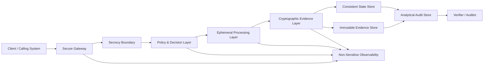

# secrecy-architecture

## Reference Architecture for Verifiable Secrecy Systems

**Version:** v1.3 — Final Architecture + Google Cloud Hardening Profile  
**Status:** Reference architecture. Not a production SAD.  
**Audience:** cloud architects, security engineers, platform engineers, auditors, and students preparing for Google Cloud architecture reviews.  
**Scope:** domain-neutral reference model for systems that process sensitive data while preserving auditability without exposing secrets.

---

## Core Thesis

`secrecy-architecture` defines a reference architecture for **verifiable secrecy systems**.

The core problem:

> How can a system process sensitive information, prove that the operation followed defined rules, and still avoid turning the secret itself into permanent liability?

The architecture separates:

1. **Secret handling** — where sensitive data enters, is minimized, processed, and destroyed.
2. **Policy enforcement** — where deterministic rules decide whether the operation may proceed.
3. **Cryptographic evidence** — where hashes, signatures, receipt chains, and sealed evidence packages prove what happened.
4. **Audit and observability** — where non-sensitive metadata supports verification, debugging, incident response, and cost governance.

This repository is intentionally **domain-neutral**.

Financial AI proxies, LLM governance, healthcare workflows, legal automation, consent-bound APIs, fraud engines, and confidential data pipelines are use cases. They belong under `use-cases/`, not in the core architecture.

---

## What This Repository Contains

| File | Purpose |
|---|---|
| [`docs/reference-architecture-v1.3.md`](./docs/reference-architecture-v1.3.md) | Current canonical reference architecture. Start here. |
| [`arquitetura.md`](./arquitetura.md) | Earlier PT-BR architecture draft for verifiable secrecy. |
| [`docs/rex-guard-production-architecture-v1.2.md`](./docs/rex-guard-production-architecture-v1.2.md) | Domain-specific production specialization for REX Guard / AI runtime governance. |
| [`schemas/`](./schemas/) | JSON Schemas for receipts and evidence events. |
| [`adr/`](./adr/) | Binding architecture decision records. |

---

## Canonical Architecture



---

## Core Model

```text
Secure Gateway
  -> Secrecy Boundary
  -> Policy & Decision Layer
  -> Ephemeral Processing Layer
  -> Cryptographic Evidence Layer
  -> Consistent State Store
  -> Immutable Evidence Store
  -> Analytical Audit Store
  -> Non-Sensitive Observability
```

### Critical separation

| Component | Role | Must Not Be Treated As |
|---|---|---|
| Consistent State Store | Idempotency, state transitions, chain head | Analytics warehouse |
| Immutable Evidence Store | Sealed evidence under locked retention | Query/reporting layer |
| Analytical Audit Store | Queryable reporting and reconciliation | Root source of immutability |

This distinction matters. Calling an analytics warehouse “immutable” is weak architecture. Immutability requires retention lock/object lock, restrictive IAM, audit logs, cryptographic reconciliation, and separation of duties.

---

## Non-Negotiable Principles

1. **Secrets do not persist by default**  
   Sensitive data must exist only for the minimum time required to complete the operation.

2. **Evidence survives without exposing the secret**  
   Audit records should contain hashes, signatures, policy results, classifications, and metadata — not raw secrets.

3. **Every sensitive operation emits a receipt**  
   A receipt is the minimum verifiable unit of control.

4. **Policy failures fail closed**  
   If identity, policy, consent, validation, signing, or evidence handling fails, the operation must deny or stop safely.

5. **Logs describe events, not payloads**  
   Observability must explain system behavior without leaking sensitive content.

6. **Immutability is an architectural property, not a slogan**  
   Append-only behavior requires retention controls, IAM restrictions, audit logs, and cryptographic reconciliation.

7. **Timeout is not cancellation**  
   Infrastructure timeouts may close client connections while compute continues. Irreversible side effects require explicit state transitions and idempotency.

8. **Security, latency, reliability, and cost are explicit trade-offs**  
   The architecture must expose operational impact instead of hiding it behind vague “secure by design” claims.

9. **Confidential computing is a profile, not a default requirement**  
   TEEs, Confidential Space, Confidential VMs, and similar controls belong in high-assurance deployments. They are not required for every reference implementation.

10. **Use cases must not contaminate the core model**  
   LLM inference, banking, healthcare, and legal workflows are implementations of the architecture, not the architecture itself.

---

## Example Google Cloud Mapping

| Requirement | Google Cloud Option |
|---|---|
| Secure ingress | Global External Application Load Balancer |
| Client certificate validation | mTLS + Certificate Manager |
| Edge security | Cloud Armor |
| API lifecycle and quotas | Optional Apigee |
| Stateless compute | Cloud Run |
| Sensitive compute segment | Confidential Space, Confidential VM, Confidential GKE Nodes |
| Key management | Cloud KMS, Cloud HSM |
| Secrets | Secret Manager |
| Strong consistency and chain head | Cloud Spanner |
| Immutable evidence package | Cloud Storage Bucket Lock |
| Analytical audit view | BigQuery |
| Logs and metrics | Cloud Logging, Cloud Monitoring |
| Tracing | Cloud Trace, OpenTelemetry |
| Policy enforcement | Open Policy Agent or custom policy service |
| CI/CD | Cloud Build, Artifact Registry |
| Supply-chain policy | Binary Authorization, build provenance, vulnerability scanning |
| Security posture | Security Command Center |

### Important GCP stance

- Firebase Hosting may be used for static documentation, demos, or frontend assets.
- It should not be the primary edge for sensitive institutional APIs requiring mTLS and certificate-based authorization.
- BigQuery should be treated as analytical materialization, not the root immutable ledger.
- Cloud Run request timeout does not guarantee process termination. Application-level cancellation and idempotency are required.
- Confidential computing should be applied selectively to the segment that handles cleartext secrets or highly sensitive payloads.

---

## Schemas

| Schema | Purpose |
|---|---|
| [`schemas/decision-receipt.schema.json`](./schemas/decision-receipt.schema.json) | Client-facing decision receipt. |
| [`schemas/evidence-event.schema.json`](./schemas/evidence-event.schema.json) | Non-reversible audit event for analytical materialization. |

The schemas intentionally reject raw payload fields such as:

- `raw_prompt`
- `prompt`
- `raw_response`
- `response`
- `document_text`
- `payload`
- `body`
- `cpf`
- `ssn`
- `password`
- `access_token`
- `private_key`
- `embedding`
- `chunk_text`

---

## ADRs

| ADR | Decision | Status |
|---|---|---|
| [`ADR-0001`](./adr/0001-separate-secret-from-evidence.md) | Separate secret from evidence | Accepted |
| [`ADR-0002`](./adr/0002-fail-closed-by-default.md) | Fail closed by default | Accepted |
| [`ADR-0003`](./adr/0003-use-spanner-for-chainhead.md) | Use Spanner for ChainHead | Accepted |
| [`ADR-0004`](./adr/0004-use-bigquery-as-ledger.md) | Use BigQuery as analytical audit view | Accepted |
| [`ADR-0005`](./adr/0005-keep-firebase-out-of-hot-path.md) | Keep Firebase out of the hot path | Accepted |

---

## REX Guard Specialization

The REX Guard production architecture applies this reference model to regulated AI inference.

Read: [`docs/rex-guard-production-architecture-v1.2.md`](./docs/rex-guard-production-architecture-v1.2.md)

Key production stance:

- Firebase Hosting is **not** in the critical inference path.
- BigQuery is analytical materialization, not root immutability.
- Cloud Spanner handles monotonic sequence and hash-chain advancement.
- Cloud Storage Bucket Lock or equivalent should hold sealed evidence packages in high-assurance profile.
- KMS/HSM signs the decision digest.
- Payloads do not enter BigQuery, logs, traces, queues, or persistent cache.
- Confidential Computing is a high-assurance hardening option, not a baseline promise.
- SLOs must be defined per route, not as a single universal latency number.

---

## Production Readiness Checklist

### Security

- [ ] Sensitive payload never appears in logs, traces, error reports, audit rows, buckets, or queues.
- [ ] KMS/HSM signs only canonical digests.
- [ ] Service accounts follow least privilege.
- [ ] Edge protection is active.
- [ ] Poison pill behavior is tested where applicable.
- [ ] Runtime image is pinned by digest.

### Evidence

- [ ] Receipt schema is versioned.
- [ ] Evidence package format is finalized.
- [ ] Immutable evidence store has retention lock/object lock.
- [ ] Delete/overwrite attempts fail before retention expiry.
- [ ] Receipt verifier exists.
- [ ] Reconciliation job exists between state, evidence, and analytics.

### Reliability

- [ ] State machine is implemented.
- [ ] Idempotency is enforced.
- [ ] Timeout behavior is tested.
- [ ] Client disconnect behavior is tested.
- [ ] Regional failover is tested where claimed.
- [ ] RTO/RPO are defined.

### Compliance

- [ ] Language says “mitigates”, “supports”, or “generates evidence” — not “guarantees compliance”.
- [ ] Retention policy is explicit.
- [ ] DPIA/LIA is performed when personal data may be linkable.
- [ ] Evidence export is available for auditors.

---

## Status

This repository is a reference architecture. It is not a certification, legal opinion, compliance guarantee, or complete production implementation.

The production posture is simple:

> **Prove the operation. Store no secret by default. Fail closed when proof cannot be produced.**
