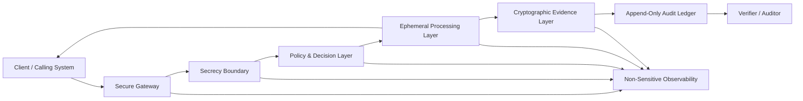
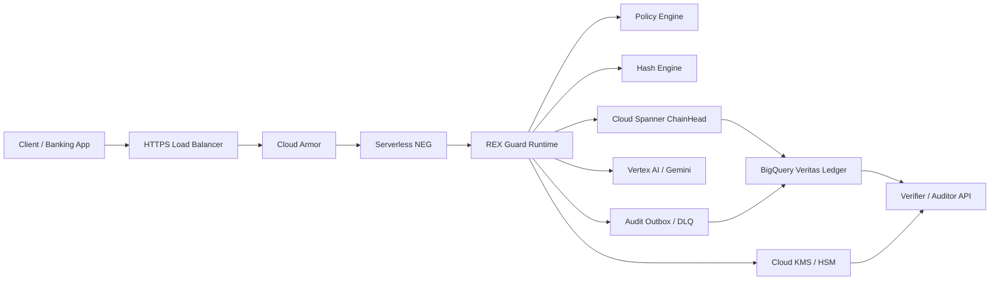

# secrecy-architecture

> Reference architecture for **verifiable secrecy systems**: ephemeral processing, cryptographic receipts, append-only evidence, and audit-safe cloud execution.

`secrecy-architecture` defines a technical pattern for systems that need to process sensitive information without turning that secret into a permanent operational liability.

The central thesis:

> **A system should be able to prove that a sensitive operation happened under defined rules without exposing or retaining the secret that was processed.**

This property is called **verifiable secrecy**.

---

## Core Idea

Traditional systems protect sensitive data after storing it.

This architecture starts from a stricter premise:

```text
Do not persist the secret unless persistence is explicitly required.
Persist proof instead.
```

The system separates:

```text
processed secret ≠ auditable evidence
```

Sensitive payloads are minimized, processed in volatile runtime, and discarded. Evidence survives through hashes, signatures, policy versions, metadata, and append-only audit trails.

---

## What This Repository Contains

| File | Purpose |
|---|---|
| [`arquitetura.md`](./arquitetura.md) | Generic reference architecture for verifiable secrecy systems. |
| [`docs/rex-guard-production-architecture-v1.2.md`](./docs/rex-guard-production-architecture-v1.2.md) | Production specialization for REX Guard / AI runtime governance. |

---

## Architecture Layers

The canonical model has five layers:

```text
1. Secrecy Boundary
2. Ephemeral Processing Layer
3. Policy & Decision Layer
4. Cryptographic Evidence Layer
5. Audit & Observability Layer
```



---

## Non-Negotiable Principles

1. **Secrets do not persist by default**  
   The happy path must not write sensitive payloads to disk, durable cache, logs, analytics, traces, or audit stores.

2. **Evidence survives without revealing the secret**  
   Auditability depends on hashes, signatures, policy versions, timestamps, and canonical metadata.

3. **Every sensitive operation emits a receipt**  
   The receipt is the minimum verifiable unit of control.

4. **Policy failure means deny**  
   Missing identity, policy, authorization, signature, or ledger consistency must block the operation.

5. **Logs describe events, not payloads**  
   Observability must explain system behavior without leaking sensitive content.

6. **Append-only is an architecture property, not marketing**  
   It requires restrictive IAM, retention policy, administrative audit logs, cryptographic reconciliation, and separation of duties.

---

## REX Guard Specialization

The REX Guard production architecture applies this pattern to regulated AI inference.



### Correct production stance

- Firebase Hosting is **not** in the critical inference path.
- BigQuery is a ledger, **not** a transactional ChainHead coordinator.
- Cloud Spanner handles monotonic sequence and hash-chain advancement.
- KMS/HSM signs the decision digest.
- Payloads do not enter BigQuery, logs, traces, buckets, Pub/Sub, or persistent cache.
- Confidential Computing is an Enterprise hardening option, not a baseline promise.
- SLOs must be defined per route, not as a single universal latency number.

Read the full production spec: [`docs/rex-guard-production-architecture-v1.2.md`](./docs/rex-guard-production-architecture-v1.2.md)

---

## Minimal Receipt Contract

```json
{
  "decision_id": "uuid-v4",
  "tenant_id": "string",
  "route": "/v1/invoke",
  "model_id": "gemini-*",
  "policy_snapshot_hash": "sha256:hex",
  "input_hash_sha256": "sha256:hex",
  "output_hash_sha256": "sha256:hex",
  "final_hash": "sha256:hex",
  "signature": {
    "algorithm": "ECDSA_P256_SHA256",
    "kms_key_version": "projects/.../cryptoKeyVersions/N",
    "signature_base64": "string"
  },
  "chain": {
    "client_id": "string",
    "sequence_index": 123,
    "previous_hash": "sha256:hex|null",
    "current_hash": "sha256:hex"
  },
  "ledger_status": "sealed|degraded|pending_reconciliation",
  "created_at": "RFC3339"
}
```

---

## Failure Policy

| Failure | Expected Behavior |
|---|---|
| Invalid identity | `DENY` |
| Missing authorization | `DENY` |
| Missing policy | `FAIL_CLOSED` |
| Policy engine unavailable | `FAIL_CLOSED` |
| KMS signing unavailable | `FAIL_CLOSED` |
| ChainHead unavailable | `FAIL_CLOSED` |
| BigQuery unavailable | degraded only with durable outbox |
| Payload detected in logs | poison pill / incident |
| Replay attempt | reject by nonce, timestamp, operation ID, or validity window |

---

## Suggested Repository Roadmap

```text
secrecy-architecture/
├── README.md
├── arquitetura.md
├── docs/
│   ├── rex-guard-production-architecture-v1.2.md
│   ├── threat-model-stride.md
│   ├── zero-persistence-controls.md
│   ├── chainhead-spanner-design.md
│   ├── evidence-ledger-bigquery.md
│   ├── failure-modes.md
│   ├── runbook.md
│   └── finops.md
├── schemas/
│   ├── decision-receipt.schema.json
│   └── evidence-event.schema.json
├── adr/
│   ├── 0001-separate-secret-from-evidence.md
│   ├── 0002-use-fail-closed-by-default.md
│   ├── 0003-use-spanner-for-chainhead.md
│   ├── 0004-use-bigquery-as-ledger.md
│   └── 0005-keep-firebase-out-of-hot-path.md
├── diagrams/
│   ├── context.mmd
│   ├── container.mmd
│   └── sequence-sensitive-flow.mmd
└── examples/
    ├── receipt-verifier/
    └── gcp-cloud-run/
```

---

## Production Readiness Checklist

### Security

- [ ] Sensitive payload never appears in logs, traces, error reports, audit rows, buckets, or queues.
- [ ] KMS/HSM signs only canonical digests.
- [ ] Service accounts follow least privilege.
- [ ] Cloud Armor or equivalent edge protection is active.
- [ ] Poison pill behavior is tested.
- [ ] Runtime image is pinned by digest.

### Data Integrity

- [ ] Receipt schema is versioned.
- [ ] Canonicalization is deterministic.
- [ ] ChainHead has concurrency tests.
- [ ] `sequence_index` is monotonic per client/tenant partition.
- [ ] Ledger rows contain no raw payload fields.

### Operations

- [ ] SLOs are defined per route.
- [ ] KMS, ChainHead, ledger, model provider, and poison pill alerts are active.
- [ ] Runbooks exist for degraded ledger, KMS quota exhaustion, ChainHead contention, and rollback.
- [ ] Load tests cover p50/p95/p99.

### Compliance

- [ ] Language says “mitigates”, “supports”, or “generates evidence” — not “guarantees compliance”.
- [ ] Retention policy is explicit.
- [ ] DPIA/LIA is performed when personal data may be linkable.
- [ ] Evidence export is available for auditors.

---

## Status

This repository is a reference architecture. It is not a certification, legal opinion, compliance guarantee, or complete production implementation.

The production posture is simple:

> **Prove the operation. Store no secret by default. Fail closed when proof cannot be produced.**
