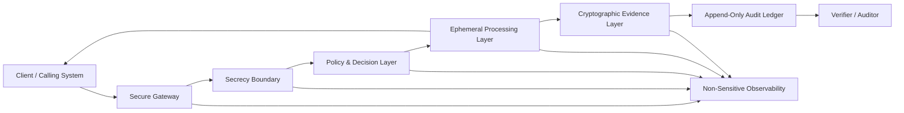
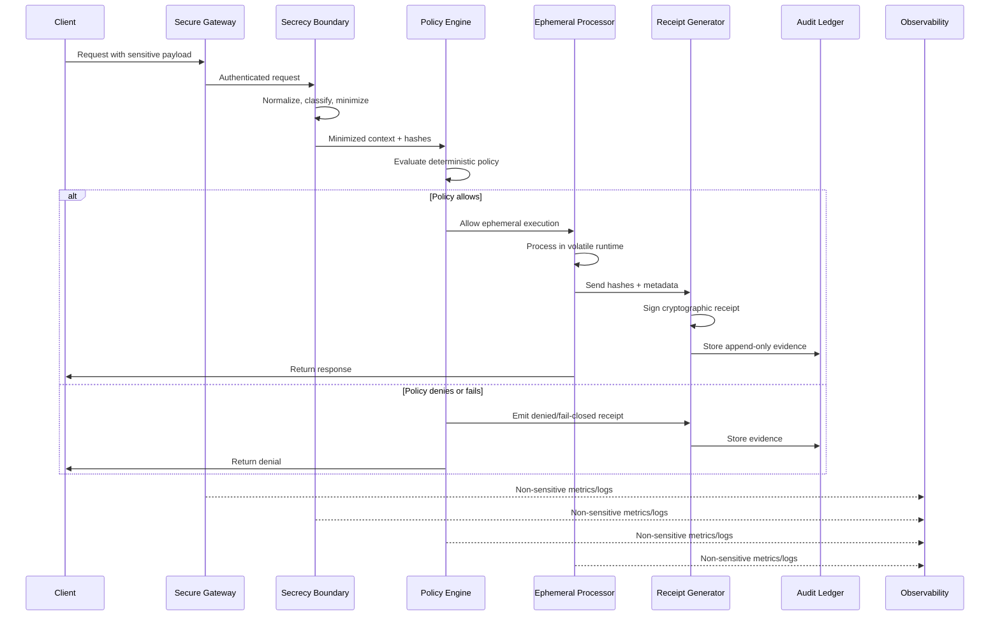
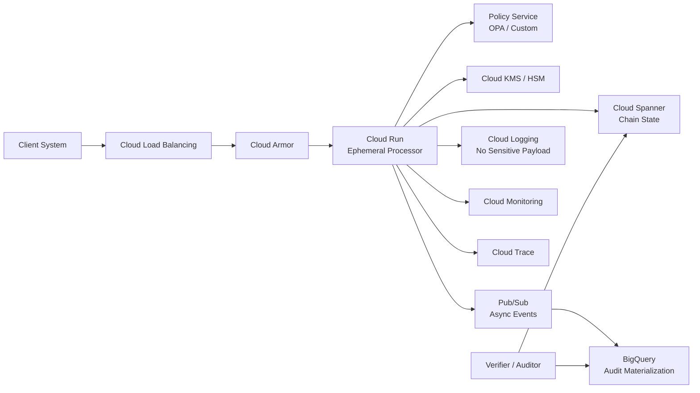

# arquitetura.md

# secrecy-architecture — Arquitetura de Referência para Sigilo Verificável

> **Reference architecture for verifiable secrecy systems: ephemeral processing, cryptographic receipts, and audit-safe cloud systems.**

**Versão:** v1.0-final  
**Status:** Arquitetura de referência pública  
**Escopo:** Sistemas que processam dados sensíveis sem transformar o segredo em passivo permanente  
**Não é:** implementação de produção, certificação regulatória, produto específico, promessa de sigilo perfeito  
**Idioma:** PT-BR  
**Repositório:** `secrecy-architecture`

---

## 1. Resumo Executivo

`secrecy-architecture` define uma arquitetura de referência para sistemas que precisam processar informações sensíveis de forma controlada, auditável e minimamente persistente.

A tese central é simples:

> Um sistema deve conseguir provar que uma operação sensível ocorreu sob regras definidas sem expor o segredo processado.

Essa propriedade é chamada neste documento de **sigilo verificável**.

A arquitetura combina:

- processamento efêmero;
- minimização de dados;
- enforcement determinístico de políticas;
- recibos criptográficos;
- trilhas append-only;
- observabilidade sem payload sensível;
- separação entre segredo e evidência;
- implementação cloud-native opcional.

---

## 2. Problema

Sistemas tradicionais tratam dados sensíveis como algo que deve ser protegido depois de armazenado.

Essa abordagem cria três problemas:

1. **Persistência como passivo**  
   Quanto mais cópias, logs, caches, snapshots e exports existem, maior o risco operacional.

2. **Auditoria dependente do próprio segredo**  
   Muitos sistemas só conseguem explicar uma operação reexpondo dados sensíveis.

3. **Confiança operacional frágil**  
   A garantia depende de configuração, disciplina humana e boas intenções, não de evidência verificável.

A pergunta arquitetural correta não é apenas:

> “Como protegemos o dado armazenado?”

A pergunta correta é:

> “Como reduzimos a necessidade de armazenar o dado e ainda preservamos prova verificável da operação?”

---

## 3. Definição Central

## 3.1 Sigilo Verificável

**Sigilo verificável** é a propriedade de um sistema conseguir demonstrar que uma operação sensível foi executada sob regras definidas sem revelar:

- o dado sensível original;
- payloads intermediários;
- segredos derivados;
- saída protegida;
- material criptográfico privado.

Formalmente, o sistema separa:

```text
segredo processado ≠ evidência auditável
```

O segredo é minimizado e descartado.  
A evidência é preservada por hashes, assinaturas, metadados e trilhas auditáveis.

---

## 4. Objetivos Arquiteturais

| Objetivo | Descrição |
|---|---|
| Minimizar persistência | Dados sensíveis não devem persistir por padrão. |
| Preservar evidência | A operação deve gerar prova verificável sem expor payloads. |
| Falhar fechado | Ausência de política, identidade, assinatura ou ledger deve bloquear a operação. |
| Reduzir vazamento operacional | Logs, métricas e traces não devem conter segredos. |
| Separar segredo de auditoria | A auditoria deve depender de metadados verificáveis, não de payload bruto. |
| Ser cloud-native | A arquitetura deve mapear bem para provedores modernos, sem acoplamento obrigatório. |
| Expor trade-offs | Latência, custo, segurança e retenção devem ser explícitos. |

---

## 5. Não-Objetivos

Esta arquitetura **não** promete:

- sigilo perfeito matemático em toda implementação;
- eliminação total de risco;
- substituição de revisão criptográfica formal;
- substituição de análise jurídica ou regulatória;
- certificação automática de compliance;
- produção sem testes de carga, threat model, hardening e revisão independente;
- exclusividade de Google Cloud, AWS, Azure ou qualquer provedor.

---

## 6. Princípios Não-Negociáveis

1. **Segredos não persistem por padrão**  
   O caminho feliz do sistema não grava payload sensível em disco, log, analytics ou cache durável.

2. **Evidência sobrevive sem revelar o segredo**  
   Auditoria deve usar hashes, assinaturas, versões de política e metadados canônicos.

3. **Toda operação sensível emite recibo**  
   O recibo é a unidade mínima de verificação.

4. **Policy failure = deny**  
   Falha de política, identidade, autorização, validação, assinatura ou consistência resulta em bloqueio.

5. **Logs descrevem eventos, não payloads**  
   Observabilidade deve explicar comportamento sem vazar conteúdo sensível.

6. **Imutabilidade é propriedade arquitetural**  
   Append-only exige IAM restritivo, retenção, trilha de auditoria e reconciliação criptográfica.

7. **Segurança, latência e custo são trade-offs explícitos**  
   Nenhum controle é “grátis”. Se aumenta segurança, pode aumentar latência e custo.

---

## 7. Modelo Conceitual

A arquitetura é composta por cinco camadas canônicas:

```text
1. Secrecy Boundary
2. Ephemeral Processing Layer
3. Policy & Decision Layer
4. Cryptographic Evidence Layer
5. Audit & Observability Layer
```

### 7.1 Diagrama de Alto Nível



---

## 8. Camadas Canônicas

## 8.1 Secrecy Boundary

A **Secrecy Boundary** é o ponto onde o sistema reconhece que está lidando com segredo.

Responsabilidades:

- autenticar e normalizar a requisição;
- classificar sensibilidade;
- reduzir payload ao mínimo necessário;
- definir escopo de uso;
- gerar identificadores efêmeros;
- impedir que payload bruto entre em logs ou traces;
- rejeitar payloads fora do contrato.

Entradas:

- requisição do cliente;
- identidade;
- contexto;
- payload potencialmente sensível.

Saídas:

- payload minimizado;
- contexto classificado;
- hashes canônicos;
- identificador de operação;
- eventos observáveis sem segredo.

---

## 8.2 Ephemeral Processing Layer

A camada de processamento efêmero executa a operação sensível com retenção mínima.

Responsabilidades:

- processar dados em runtime temporário;
- evitar persistência intencional de payload sensível;
- aplicar TTLs curtos;
- apagar referências em memória quando possível;
- impedir escrita acidental em disco, logs ou cache;
- isolar execução por operação, tenant ou escopo.

Exemplos de controles:

- containers stateless;
- filesystem read-only quando possível;
- desabilitar dumps;
- não registrar payload em exceções;
- garbage collection e limpeza explícita quando aplicável;
- sandboxing;
- confidential computing quando o risco exigir.

Importante:

> “Ephemeral” não significa “magicamente seguro”.  
> Significa que a arquitetura reduz superfícies de persistência e exige prova operacional de que payloads não foram gravados.

---

## 8.3 Policy & Decision Layer

A camada de política decide se a operação pode ocorrer.

Responsabilidades:

- validar identidade;
- validar autorização;
- validar contexto;
- validar consentimento ou base de permissão quando aplicável;
- aplicar regras determinísticas;
- validar saída antes de resposta;
- falhar fechado quando política estiver ausente ou indisponível.

Decisões possíveis:

```text
ALLOW
DENY
REVIEW
FAIL_CLOSED
```

Regras:

- política deve ser versionada;
- decisão deve ser determinística quando possível;
- resultado da política deve entrar no recibo;
- falhas técnicas não devem virar aprovação.

---

## 8.4 Cryptographic Evidence Layer

A camada de evidência criptográfica gera prova verificável da operação.

Responsabilidades:

- canonicalizar inputs e outputs relevantes;
- calcular hashes;
- assinar recibos;
- encadear recibos quando aplicável;
- preservar versões de política;
- preservar versões de modelo, regra ou executor quando aplicável;
- permitir verificação independente.

A evidência nunca deve conter payload sensível bruto.

---

## 8.5 Audit & Observability Layer

A camada de auditoria e observabilidade mantém rastreabilidade sem reter segredos.

Responsabilidades:

- armazenar recibos;
- armazenar eventos técnicos sem payload sensível;
- expor métricas de latência, erro, bloqueio e custo;
- permitir reconciliação criptográfica;
- suportar investigação sem vazamento;
- registrar mudanças de política e configuração.

Exemplos de eventos permitidos:

```json
{
  "event": "policy_evaluated",
  "operation_id": "op_123",
  "decision": "DENY",
  "policy_version": "2026-04-30.1",
  "reason_code": "MISSING_SCOPE",
  "latency_ms": 42
}
```

Exemplos proibidos:

```json
{
  "cpf": "123.456.789-00",
  "full_name": "Nome Real",
  "raw_prompt": "conteúdo sensível...",
  "document_text": "payload completo..."
}
```

---

## 9. Fluxo Sensível



---

## 10. Contrato do Recibo Criptográfico

O recibo é a unidade mínima de prova.

Ele deve responder:

- qual operação ocorreu;
- sob qual política;
- com qual decisão;
- em qual momento;
- qual entrada foi usada, representada por hash;
- qual resultado foi produzido, representado por hash;
- qual recibo anterior foi usado no encadeamento, se aplicável;
- qual chave assinou a evidência;
- como verificar a assinatura.

### 10.1 Exemplo de Recibo

```json
{
  "receipt_id": "018f9b60-7e5a-7c40-9af3-4af9d7ccf001",
  "operation_id": "018f9b60-7e5a-7c40-9af3-4af9d7ccf002",
  "subject_hash": "sha256:...",
  "request_hash": "sha256:...",
  "policy_hash": "sha256:...",
  "result_hash": "sha256:...",
  "decision": "ALLOW",
  "policy_version": "2026-04-30.1",
  "evidence_version": "1.0",
  "previous_receipt_hash": "sha256:...",
  "current_receipt_hash": "sha256:...",
  "signature_algorithm": "ECDSA_P256_SHA256",
  "key_id": "kms-or-hsm-key-version",
  "signature": "base64...",
  "created_at": "2026-04-30T22:06:00Z"
}
```

### 10.2 Regras do Recibo

- Não contém payload sensível bruto.
- Usa canonicalização estável antes de hash.
- Inclui versão da política.
- Inclui algoritmo de assinatura.
- Inclui referência à chave pública ou versão da chave.
- Pode ser verificado fora do sistema produtor.
- Pode ser encadeado para detectar adulteração histórica.

---

## 11. Ledger Append-Only

O ledger é onde recibos e eventos auditáveis são preservados.

A arquitetura não assume que um banco ou warehouse seja “imutável por mágica”.

A propriedade append-only depende de:

- modelo de permissão sem `UPDATE` e `DELETE` para identidades aplicacionais;
- logs de auditoria administrativos;
- retenção configurada;
- backups protegidos;
- reconciliação criptográfica;
- separação entre writer e auditor;
- alertas para tentativa de mutação;
- verificação periódica da cadeia.

### 11.1 Chain Verification

Quando recibos são encadeados:

```text
current_receipt_hash = SHA256(canonical_receipt_without_signature + previous_receipt_hash)
```

A verificação deve detectar:

- remoção de recibos;
- alteração de recibos;
- reordenação não autorizada;
- assinatura inválida;
- divergência entre ledger e snapshot externo.

---

## 12. Modos de Consistência

Nem toda aplicação exige o mesmo nível de bloqueio.

| Modo | Comportamento | Uso recomendado |
|---|---|---|
| Strict | Sem recibo assinado e persistido, não há resposta de sucesso. | Operações críticas. |
| Buffered | Recibo assinado localmente e persistido depois, com fila durável. | Baixa latência com tolerância operacional. |
| Async Evidence | Operação responde antes da materialização auditável. | Baixo risco, analytics, eventos não críticos. |

Regra padrão:

```text
Operação sensível crítica deve usar modo Strict.
```

---

## 13. Failure Modes

| Falha | Comportamento esperado |
|---|---|
| Identidade inválida | DENY |
| Autorização ausente | DENY |
| Política ausente | FAIL_CLOSED |
| Policy engine indisponível | FAIL_CLOSED |
| Payload fora do contrato | DENY |
| Detecção de segredo em log | Bloquear deploy ou abrir incidente |
| Assinatura indisponível | FAIL_CLOSED em modo Strict |
| Ledger indisponível | FAIL_CLOSED em modo Strict |
| Observabilidade indisponível | Continuar somente se garantias centrais forem preservadas |
| Chave comprometida | Rotacionar chave, revogar versão, marcar recibos afetados |
| Reordenação de recibos | Detectar via chain verification |
| Replay attack | Rejeitar por nonce, timestamp, operation_id ou janela de validade |

---

## 14. Threat Model — STRIDE

| Categoria | Ameaça | Controle arquitetural |
|---|---|---|
| Spoofing | Cliente ou serviço falso | mTLS, IAM, assinatura, tokens curtos |
| Tampering | Alteração de recibo ou evento | Hash chain, assinatura, append-only, auditoria |
| Repudiation | Negação de operação | Recibo assinado, timestamp, key version |
| Information Disclosure | Vazamento em log/cache/trace | minimização, redaction, controles de observabilidade |
| Denial of Service | Exaustão do gateway/policy/KMS | rate limit, quotas, circuit breaker |
| Elevation of Privilege | Acesso indevido a segredo ou ledger | least privilege, separation of duties, IAM boundaries |

### 14.1 Ameaças Específicas

- vazamento de payload em exception stack trace;
- debug log ativado em produção;
- cache persistente acidental;
- export não autorizado de ledger;
- chave de assinatura usada por serviço errado;
- política permissiva por default;
- falha de canonicalização;
- recibos assinados com campos ambíguos;
- replay de requisição previamente aprovada;
- métricas com cardinalidade sensível.

---

## 15. Implementação de Referência em Google Cloud

Esta é uma implementação possível, não obrigatória.

| Requisito | Serviço Google Cloud possível |
|---|---|
| Entrada segura | Cloud Load Balancing, Cloud Armor |
| Execução stateless | Cloud Run |
| Segredos de runtime | Secret Manager |
| Chaves e assinatura | Cloud KMS / Cloud HSM |
| Estado consistente de cadeia | Cloud Spanner |
| Materialização analítica | BigQuery |
| Logs | Cloud Logging |
| Métricas | Cloud Monitoring |
| Tracing | Cloud Trace |
| Mensageria assíncrona | Pub/Sub |
| Fila/tarefas | Cloud Tasks |
| Build e deploy | Cloud Build, Artifact Registry |
| Postura de segurança | Security Command Center |
| Isolamento avançado opcional | Confidential Space / Confidential Computing |

### 15.1 Diagrama GCP Exemplo



### 15.2 Observação sobre Cloud Provider

A mesma arquitetura pode ser adaptada para outros provedores.

O mapeamento conceitual é:

```text
Gateway seguro -> Runtime efêmero -> Policy engine -> KMS/HSM -> Ledger -> Observability
```

---

## 16. IAM e Separação de Funções

Papéis mínimos recomendados:

| Ator | Permissão |
|---|---|
| Runtime service account | Invocar KMS sign, escrever recibos, publicar eventos |
| Policy admin | Alterar políticas, sem acesso a payload sensível |
| Ledger writer | Append-only |
| Auditor | Read-only em recibos e logs não sensíveis |
| Security admin | Gerenciar chaves e rotação |
| Developer | Deploy via pipeline, sem acesso direto a dados sensíveis |
| Break-glass | Acesso emergencial auditado e temporário |

Regras:

- nenhum usuário humano deve usar conta aplicacional;
- nenhuma conta aplicacional deve ter permissão administrativa ampla;
- alteração de política exige trilha auditável;
- rotação de chave deve preservar verificabilidade histórica;
- acesso break-glass deve ser excepcional e monitorado.

---

## 17. Observabilidade Sem Vazamento

### 17.1 Métricas Obrigatórias

- taxa de ALLOW / DENY / REVIEW / FAIL_CLOSED;
- latência p50, p95, p99;
- tempo de policy evaluation;
- tempo de assinatura;
- tempo de escrita no ledger;
- taxa de erro por camada;
- volume de payload rejeitado por validação;
- custo por 1.000 operações;
- tentativas de replay;
- tentativas de mutação no ledger.

### 17.2 Logs Permitidos

```json
{
  "event": "receipt_signed",
  "operation_id": "op_123",
  "decision": "ALLOW",
  "policy_version": "2026-04-30.1",
  "signature_algorithm": "ECDSA_P256_SHA256",
  "latency_ms": 87
}
```

### 17.3 Logs Proibidos

- payload completo;
- prompt completo sensível;
- documento original;
- CPF, RG, passaporte, cartão ou identificador direto;
- segredo derivado;
- chave privada;
- token de acesso;
- resposta sensível não minimizada.

---

## 18. Performance e Latência

A arquitetura deve medir latência por componente.

### 18.1 Orçamento de Latência

| Etapa | Métrica |
|---|---|
| Gateway | p50/p95/p99 |
| Secrecy Boundary | p50/p95/p99 |
| Policy Engine | p50/p95/p99 |
| Processor | p50/p95/p99 |
| KMS/HSM signing | p50/p95/p99 |
| Ledger write | p50/p95/p99 |
| Response total | p50/p95/p99 |

### 18.2 Regra

Nenhuma meta de latência deve ser aceita sem benchmark.

Exemplo de meta de estudo:

```text
p95 <= 520 ms para hot path sem cold start, validado em ambiente controlado.
```

Não trate a meta como garantia antes de medição.

---

## 19. FinOps

A arquitetura deve estimar custo por operação.

### 19.1 Fórmula Base

```text
Custo por 1.000 operações =
  gateway/load balancer
+ runtime CPU/memória
+ policy evaluation
+ KMS/HSM signing
+ ledger writes
+ analytics materialization
+ logs/metrics/traces
+ network egress
+ storage retention
+ security scanning/monitoring
```

### 19.2 Cenários Obrigatórios

| Cenário | Objetivo |
|---|---|
| Baseline | tráfego normal |
| Peak | pico de uso |
| Fail-closed storm | dependência falhando e bloqueios em massa |
| Audit-heavy | auditoria consultando ledger intensivamente |
| Retention-heavy | retenção longa com volume alto |

### 19.3 Trade-off Central

Mais evidência aumenta custo.  
Menos evidência reduz custo, mas enfraquece auditabilidade.

Decisão correta depende de criticidade da operação.

---

## 20. Confiabilidade

### 20.1 SLOs Recomendados

| SLO | Exemplo |
|---|---|
| Disponibilidade do gateway | 99.9% |
| Disponibilidade do policy engine | 99.9% |
| Assinatura de recibos | 99.9% |
| Escrita do ledger strict | 99.9% |
| Verificação de recibos | 99.9% |

### 20.2 RTO/RPO

| Componente | RTO | RPO |
|---|---:|---:|
| Gateway | minutos | 0 |
| Policy Engine | minutos | última versão publicada |
| KMS/HSM | depende do provedor | 0 para chave preservada |
| Ledger | minutos-horas | conforme modo de consistência |
| Observability | horas | tolerância maior, desde que core preserve segurança |

### 20.3 Degradação

Em operação crítica, degradação segura é preferível a aprovação insegura.

```text
fail-safe > fail-open
```

---

## 21. Segurança de Chaves

Regras:

- chaves privadas não saem do KMS/HSM;
- cada ambiente tem chaves separadas;
- rotação programada;
- rotação emergencial documentada;
- key version registrada no recibo;
- verificador externo usa chave pública;
- permissões de assinatura são mínimas;
- destruição/revogação de chave exige procedimento formal.

Risco importante:

> Se a chave de assinatura for comprometida, a cadeia de confiança precisa de marcação de período afetado, rotação e publicação de nova raiz de confiança.

---

## 22. Canonicalização

Hash sem canonicalização é convite para ambiguidade.

Antes de assinar ou calcular hash:

- ordenar campos;
- normalizar encoding;
- remover campos voláteis não determinísticos;
- fixar representação de datas;
- fixar formato numérico;
- declarar versão do schema;
- declarar algoritmo.

Exemplo:

```text
canonical_json = JSON.stringify(object, sorted_keys=true, no_whitespace=true)
hash = SHA256(canonical_json)
signature = SIGN(hash)
```

---

## 23. Ambientes

| Ambiente | Uso | Dados reais? |
|---|---|---|
| Local | desenvolvimento | não |
| Dev | integração inicial | não |
| Staging | teste próximo de produção | sintético ou mascarado |
| Production | operação real | sim, com controles completos |
| Audit Sandbox | verificação externa | não sensível ou amostras controladas |

Regra:

```text
Dados reais não entram em ambiente sem controles equivalentes ao risco.
```

---

## 24. Checklist de Prontidão

Antes de produção, exigir:

- [ ] threat model STRIDE completo;
- [ ] JSON Schema formal do recibo;
- [ ] verificador independente de recibos;
- [ ] testes de canonicalização;
- [ ] testes de assinatura;
- [ ] testes de replay;
- [ ] testes de fail-closed;
- [ ] testes de carga p50/p95/p99;
- [ ] revisão IAM;
- [ ] revisão de logs;
- [ ] revisão de retenção;
- [ ] plano de rotação de chaves;
- [ ] plano de incidente;
- [ ] modelo FinOps;
- [ ] runbook operacional;
- [ ] ADRs aprovados.

---

## 25. ADRs Recomendados

| ADR | Decisão |
|---|---|
| ADR-0001 | Usar processamento efêmero por padrão |
| ADR-0002 | Separar segredo de evidência |
| ADR-0003 | Emitir recibos criptográficos |
| ADR-0004 | Usar ledger append-only |
| ADR-0005 | Falhar fechado por padrão |
| ADR-0006 | Canonicalizar antes de hash/assinatura |
| ADR-0007 | Não registrar payload sensível |
| ADR-0008 | Exigir verificador independente |

---

## 26. Estrutura Recomendada do Repositório

```text
secrecy-architecture/
├── README.md
├── arquitetura.md
├── docs/
│   ├── 00-theory.md
│   ├── 01-design-principles.md
│   ├── 02-reference-architecture.md
│   ├── 03-secrecy-boundary.md
│   ├── 04-ephemeral-processing.md
│   ├── 05-policy-enforcement.md
│   ├── 06-cryptographic-receipts.md
│   ├── 07-audit-ledger.md
│   ├── 08-threat-model.md
│   ├── 09-gcp-implementation.md
│   ├── 10-finops.md
│   └── 11-runbook.md
├── diagrams/
│   ├── c4-context.mmd
│   ├── c4-container.mmd
│   ├── sequence-sensitive-flow.mmd
│   └── trust-boundaries.mmd
├── schemas/
│   └── sealed-receipt.schema.json
├── adr/
│   ├── 0001-use-ephemeral-processing.md
│   ├── 0002-separate-secret-from-evidence.md
│   ├── 0003-use-cryptographic-receipts.md
│   ├── 0004-use-append-only-ledger.md
│   └── 0005-fail-closed-by-default.md
├── examples/
│   ├── gcp-cloud-run/
│   ├── receipt-verifier/
│   └── policy-engine/
├── terraform/
│   └── gcp/
└── use-cases/
    └── financial-ai-proxy/
```

---

## 27. Use Cases

O README e esta arquitetura definem o núcleo genérico.

Casos específicos devem ficar em `use-cases/`.

Exemplos:

| Use case | Descrição |
|---|---|
| financial-ai-proxy | Proxy de inferência para dados financeiros sensíveis |
| healthcare-record-check | Verificação de registros médicos sem expor prontuário |
| identity-verification | Verificação de identidade com recibo sem persistir documento |
| confidential-rag | RAG com evidência auditável e minimização de payload |
| regulated-decisioning | Decisões reguladas com recibos e políticas versionadas |

Regra:

```text
Use case não deve contaminar arquitetura-mãe.
```

---

## 28. Roadmap

- [ ] C4 Context diagram;
- [ ] C4 Container diagram;
- [ ] STRIDE completo;
- [ ] JSON Schema do recibo;
- [ ] verificador de recibo em Python;
- [ ] verificador de recibo em TypeScript;
- [ ] exemplo Google Cloud;
- [ ] Terraform blueprint;
- [ ] benchmark plan;
- [ ] FinOps calculator;
- [ ] runbook de incidentes;
- [ ] política de logs seguros;
- [ ] ADRs completas;
- [ ] checklist de produção.

---

## 29. Mini-ADR da Arquitetura

### Contexto

Sistemas que lidam com dados sensíveis precisam equilibrar sigilo, auditabilidade, performance e custo.

Persistir payload sensível facilita auditoria, mas aumenta risco.  
Eliminar payload reduz risco, mas pode enfraquecer prova.

### Opções

1. Persistir payload e proteger com controles tradicionais.
2. Não persistir payload e perder auditabilidade.
3. Separar segredo de evidência com recibos criptográficos.

### Decisão

Adotar a opção 3.

### Consequências

Positivas:

- reduz passivo de dados;
- preserva verificabilidade;
- facilita auditoria sem reexposição;
- melhora postura de segurança.

Negativas:

- aumenta complexidade;
- exige canonicalização rigorosa;
- exige gestão de chaves;
- exige verificador independente;
- exige disciplina forte de logs e observabilidade.

---

## 30. Conclusão

`secrecy-architecture` propõe uma arquitetura de referência para transformar sigilo em propriedade verificável.

A arquitetura não depende de confiança cega no operador.  
Ela reduz persistência de segredos e preserva evidência por meio de hashes, assinaturas, políticas versionadas e trilhas append-only.

A tese final:

> O segredo deve ser efêmero.  
> A evidência deve ser verificável.  
> O sistema deve falhar fechado.  
> A auditoria não deve exigir reexposição do segredo.

Isso é sigilo verificável.

---

## 31. Glossário

| Termo | Definição |
|---|---|
| Secret | Dado que não deve ser exposto ou persistido indevidamente. |
| Verifiable Secrecy | Capacidade de provar operação sensível sem expor segredo. |
| Secrecy Boundary | Fronteira onde dado sensível é classificado e minimizado. |
| Ephemeral Processing | Processamento com retenção mínima e sem persistência intencional. |
| Cryptographic Receipt | Prova assinada de uma operação. |
| Append-Only Ledger | Registro onde eventos são adicionados sem mutação operacional. |
| Fail-Closed | Comportamento que nega operação em caso de falha. |
| Canonicalization | Normalização determinística antes de hash ou assinatura. |
| Chain Verification | Verificação de integridade por encadeamento de hashes. |
| Non-Sensitive Observability | Logs, métricas e traces sem payload sensível. |
