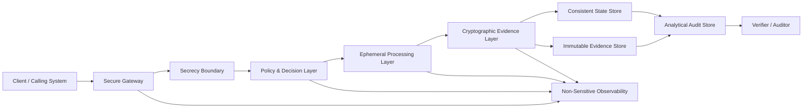
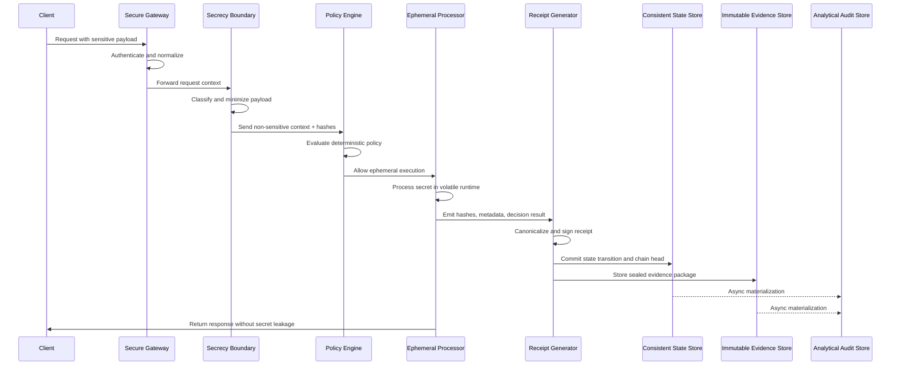
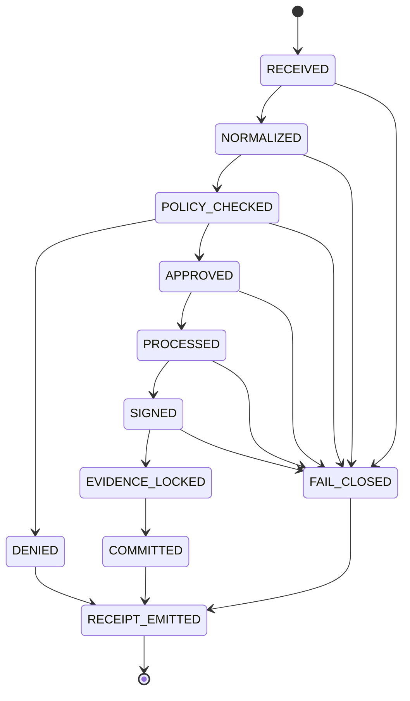
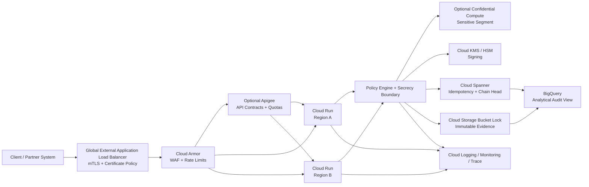

# secrecy-architecture

## Reference Architecture for Verifiable Secrecy Systems

**Version:** v1.3 — Final Architecture + Google Cloud Hardening Profile  
**Status:** Reference architecture. Not a production SAD.  
**Audience:** cloud architects, security engineers, platform engineers, auditors, and students preparing for Google Cloud architecture reviews.  
**Scope:** domain-neutral reference model for systems that process sensitive data while preserving auditability without exposing secrets.

---

## 0. Executive Summary

`secrecy-architecture` defines a reference architecture for **verifiable secrecy systems**.

The core problem is simple:

> How can a system process sensitive information, prove that the operation followed defined rules, and still avoid turning the secret itself into permanent liability?

The architecture separates:

1. **Secret handling** — where sensitive data enters, is minimized, processed, and destroyed.
2. **Policy enforcement** — where deterministic rules decide whether the operation may proceed.
3. **Cryptographic evidence** — where hashes, signatures, receipt chains, and sealed evidence packages prove what happened.
4. **Audit and observability** — where non-sensitive metadata supports verification, debugging, incident response, and cost governance.

This document is intentionally **domain-neutral**.

Financial AI proxies, LLM governance, healthcare workflows, legal automation, consent-bound APIs, fraud engines, and confidential data pipelines are use cases. Domain-specific material belongs under `use-cases/`, not in the core architecture.

---

## 1. Core Definition

### 1.1 Verifiable Secrecy

**Verifiable secrecy** means:

> A system can prove that a sensitive operation was executed under defined rules without exposing the sensitive input, intermediate payload, or protected output.

This does **not** mean perfect secrecy in the mathematical Shannon sense for every implementation.

It means the architecture produces verifiable evidence while minimizing exposure of the underlying secret.

### 1.2 What Must Be Proven

| Question | Evidence |
|---|---|
| Who or what requested the operation? | Identity metadata, certificate fingerprint, subject hash, request hash |
| Was the request allowed? | Policy result, policy version, decision code |
| What data class was processed? | Sensitivity label, classification metadata, not raw payload |
| Was the operation completed? | State transition, receipt, timestamp |
| Was the evidence tampered with? | Hash chain, signature, locked evidence package |
| Can an auditor verify the result without seeing the secret? | Cryptographic receipt and non-sensitive audit metadata |

---

## 2. Design Principles

1. **Secrets should not persist by default**  
   Sensitive data must exist only for the minimum time required to complete the operation.

2. **Evidence must survive without exposing the secret**  
   Audit records should contain hashes, signatures, policy results, classifications, and metadata — not raw secrets.

3. **Every sensitive operation must produce a receipt**  
   A receipt is a verifiable record of what happened, under which policy, at what time, with which integrity proof.

4. **Policy failures must fail closed**  
   If identity, policy, consent, validation, signing, or evidence handling fails, the operation must deny or stop safely.

5. **Logs must describe events, not leak payloads**  
   Observability must support debugging and security investigation without storing sensitive data.

6. **Immutability is an architectural property, not a slogan**  
   Append-only behavior requires storage controls, retention lock, IAM restrictions, audit logs, and cryptographic reconciliation.

7. **Timeout is not cancellation**  
   Infrastructure timeouts may close client connections while compute continues. Irreversible side effects must be guarded by explicit state transitions and idempotency.

8. **Security, latency, reliability, and cost are explicit trade-offs**  
   The architecture must expose operational impact instead of hiding it behind vague “secure by design” claims.

9. **Confidential computing is a profile, not a default requirement**  
   TEEs, Confidential Space, Confidential VMs, and similar controls belong in high-assurance deployments. They are not required for every reference implementation.

10. **Use cases must not contaminate the core model**  
   LLM inference, banking, healthcare, and legal workflows are implementations of the architecture, not the architecture itself.

---

## 3. Canonical Architecture



---

## 4. Canonical Layers

| Layer | Responsibility | Must Not Do |
|---|---|---|
| Secure Gateway | Authenticate callers, enforce perimeter controls, normalize inbound requests | Store sensitive payloads in logs |
| Secrecy Boundary | Classify data, minimize payloads, define retention constraints | Allow raw secrets to flow uncontrolled |
| Policy & Decision Layer | Enforce deterministic rules before and after processing | Delegate final authority to probabilistic systems |
| Ephemeral Processing Layer | Execute sensitive operations in short-lived runtime contexts | Persist secrets intentionally |
| Cryptographic Evidence Layer | Produce hashes, signatures, receipts, and chain links | Store raw sensitive payloads in receipts |
| Consistent State Store | Maintain idempotency, state transitions, chain head, and operation status | Act as analytics warehouse |
| Immutable Evidence Store | Store sealed evidence packages under locked retention | Permit overwrite/delete before retention expires |
| Analytical Audit Store | Provide queryable views, dashboards, reconciliation, reporting | Serve as root source of immutability |
| Observability Layer | Emit logs, metrics, traces, and alerts without sensitive payloads | Leak secrets through telemetry |

---

## 5. Sensitive Data Flow



---

## 6. Evidence Architecture

The architecture separates **transactional state**, **immutable evidence**, and **analytical audit views**.

| Component | Role | Example |
|---|---|---|
| Strongly Consistent State Store | Maintains operation state, idempotency keys, receipt chain head, and state transitions | Cloud Spanner, PostgreSQL with serializable isolation, FoundationDB |
| Immutable Evidence Store | Stores sealed evidence packages under retention lock | Cloud Storage Bucket Lock, object lock equivalent |
| Analytical Audit Store | Provides queryable views, dashboards, reports, and reconciliation | BigQuery, data warehouse, SIEM index |

The analytical audit store is **not** the source of immutability.

Immutability is achieved through a combination of:

- retention lock or object lock;
- restrictive IAM;
- no application permissions for overwrite/delete;
- audit logs;
- cryptographic hash chains;
- signature verification;
- reconciliation between state store, evidence store, and analytical views.

### 6.1 Evidence Package

An evidence package is the sealed artifact stored in the immutable evidence store.

It may contain:

- cryptographic receipt;
- canonical metadata;
- policy result;
- source hashes;
- response hash;
- model or processing version;
- key version;
- chain links;
- verification instructions.

It must not contain raw sensitive payloads unless the deployment explicitly requires it and the evidence store is designed for that retention obligation.

---

## 7. Cryptographic Receipt

A cryptographic receipt is the minimum verifiable evidence emitted by the system.

Example structure:

```json
{
  "receipt_id": "uuid",
  "operation_id": "uuid",
  "idempotency_key": "string",
  "subject_hash": "sha256:<hex>",
  "request_hash": "sha256:<hex>",
  "input_classification": "PII | SECRET | CONFIDENTIAL | PUBLIC",
  "policy_hash": "sha256:<hex>",
  "policy_version": "string",
  "result_hash": "sha256:<hex>",
  "decision": "ALLOW | DENY | REVIEW | FAIL_CLOSED",
  "decision_code": "string",
  "previous_receipt_hash": "sha256:<hex>",
  "current_receipt_hash": "sha256:<hex>",
  "evidence_object_uri": "uri",
  "evidence_object_hash": "sha256:<hex>",
  "signature_algorithm": "ECDSA_P256_SHA256",
  "signature_key_version": "string",
  "signature": "base64",
  "created_at": "RFC3339"
}
```

The receipt must not contain raw sensitive data.

### 7.1 Receipt Verification

A verifier should be able to:

1. Recompute the receipt hash.
2. Validate the signature.
3. Validate the previous/current hash chain.
4. Check that the referenced evidence object exists.
5. Check that the evidence object hash matches.
6. Check that the evidence object is under expected retention controls.
7. Reconcile receipt metadata with the analytical audit store.

---

## 8. Decision State Machine

Sensitive operations must be modeled as explicit state transitions.



### 8.1 Side-Effect Rule

Irreversible side effects must only occur after the operation reaches a state where:

- idempotency key is registered;
- policy result is known;
- receipt is canonicalized;
- evidence handling is consistent;
- retries cannot duplicate external effects.

### 8.2 Timeout and Disconnect Rule

A client timeout or disconnect must not be treated as automatic cancellation.

The implementation must support:

- deadline propagation;
- cooperative cancellation;
- idempotency keys;
- state recovery;
- retry-safe transitions;
- explicit side-effect boundaries.

---

## 9. Failure Modes

| Failure | Expected Behavior |
|---|---|
| Invalid identity | Deny |
| Missing policy | Fail closed |
| Policy engine unavailable | Fail closed |
| Sensitive payload detected in logs | Block deployment or trigger incident |
| KMS/signing failure | Deny and emit technical failure receipt |
| State store unavailable | Fail closed unless a documented degraded mode exists |
| Immutable evidence store unavailable | Fail closed for high-assurance profile |
| Analytical audit store unavailable | Continue only if state and evidence are preserved |
| Observability unavailable | Continue only if secrecy guarantees are preserved |
| Client disconnect | Continue or cancel only according to explicit state-machine rules |
| Timeout | Prevent late irreversible side effects unless state transition allows it |
| Replay detected | Deny or return existing idempotent result |

---

## 10. Deployment Profiles

| Profile | Target | Controls |
|---|---|---|
| Reference | Education, architecture review, local prototype | Core layers, receipts, policy, non-sensitive observability |
| Hardened | Enterprise cloud workload | mTLS, WAF, locked evidence retention, dual-region, supply-chain controls |
| High Assurance | Regulated sensitive processing | Confidential compute, formal threat model, DR drills, evidence package validation |

### 10.1 Reference Profile

Minimum controls:

- request normalization;
- data classification;
- deterministic policy decision;
- cryptographic receipt;
- non-sensitive logging;
- basic receipt verification;
- clear non-goals.

### 10.2 Hardened Profile

Additional controls:

- external application load balancer;
- mTLS;
- WAF and rate limiting;
- locked retention for evidence packages;
- strongly consistent idempotency and chain state;
- dual-region service deployment;
- health/readiness checks;
- supply-chain provenance;
- vulnerability scanning;
- SLO dashboards and burn-rate alerts.

### 10.3 High Assurance Profile

Additional controls:

- confidential computing for sensitive segments;
- enclave or TEE boundary for PII processing;
- formal STRIDE threat model;
- data protection impact assessment where applicable;
- DR drill evidence;
- signed build provenance;
- strict separation of duties;
- breakglass access process;
- independent security review;
- formal evidence package validation.

---

## 11. Example Google Cloud Implementation

This reference architecture can be implemented on Google Cloud. This is an example, not the only valid implementation.

| Requirement | Google Cloud Option |
|---|---|
| Secure ingress | Global External Application Load Balancer |
| Client certificate validation | mTLS + Certificate Manager |
| Edge security | Cloud Armor |
| API lifecycle and quotas | Optional Apigee |
| Stateless compute | Cloud Run |
| Sensitive compute segment | Confidential Space, Confidential VM, Confidential GKE Nodes |
| Key management | Cloud KMS, Cloud HSM |
| Secrets | Secret Manager |
| Strong consistency and chain head | Cloud Spanner |
| Immutable evidence package | Cloud Storage Bucket Lock |
| Analytical audit view | BigQuery |
| Logs and metrics | Cloud Logging, Cloud Monitoring |
| Tracing | Cloud Trace, OpenTelemetry |
| Policy enforcement | Open Policy Agent or custom policy service |
| CI/CD | Cloud Build, Artifact Registry |
| Supply-chain policy | Binary Authorization, build provenance, vulnerability scanning |
| Security posture | Security Command Center |

### 11.1 Recommended GCP Hardened Topology



### 11.2 GCP Notes

- Firebase Hosting may be used for static documentation, demos, or frontend assets.
- It should not be the primary edge for sensitive institutional APIs requiring mTLS and certificate-based authorization.
- BigQuery should be treated as analytical materialization, not the root immutable ledger.
- Cloud Run multi-region requires explicit load balancing, serverless NEGs, health/readiness behavior, and failover testing.
- Cloud Run request timeout does not guarantee process termination. Application-level cancellation and idempotency are required.
- Confidential computing should be applied selectively to the segment that handles cleartext secrets or highly sensitive payloads.

---

## 12. Observability Without Leakage

Observability must answer operational questions without exposing sensitive data.

### 12.1 Required Signals

| Signal | Purpose |
|---|---|
| Request count | Traffic visibility |
| Decision count by code | Policy behavior |
| Fail-closed count | Safety signal |
| Latency by layer/gate | Performance debugging |
| Receipt verification failures | Integrity monitoring |
| Evidence write failures | Auditability monitoring |
| Replay attempts | Abuse detection |
| Rate-limit events | Cost and abuse control |
| Redaction failures | Security incident trigger |

### 12.2 Logging Rules

Logs must include:

- operation ID;
- receipt ID;
- decision code;
- policy version;
- latency;
- error category;
- dependency status.

Logs must not include:

- raw secrets;
- raw PII;
- authorization tokens;
- private keys;
- full prompts containing sensitive data;
- model outputs containing protected content unless explicitly classified and protected.

### 12.3 Trace Rules

Distributed traces should contain spans for:

- ingress;
- normalization;
- secrecy boundary;
- policy pre-check;
- ephemeral processing;
- policy post-check;
- receipt generation;
- state commit;
- evidence storage;
- analytical fan-out.

Trace attributes must be scrubbed.

---

## 13. Reliability and Resilience

### 13.1 SLO Examples

| SLI | Example Target |
|---|---|
| Successful policy decisions | 99.9% |
| Receipt generation success | 99.95% |
| Evidence package write success | 99.99% |
| Receipt verification success | 99.99% |
| p95 latency for reference profile | Defined by implementation |
| p95 latency for hardened profile | Requires benchmark |
| Failover recovery time | Requires DR drill |

### 13.2 Resilience Requirements

A hardened deployment should include:

- explicit regional topology;
- health/readiness behavior;
- failover drill;
- RTO/RPO targets;
- dependency timeout budgets;
- retry policies with idempotency;
- circuit breakers;
- dead-letter handling for async fan-out;
- degraded mode definition.

### 13.3 Multi-Region Rule

Multi-region must be proven operationally.

It is not enough to deploy in two regions. The system must demonstrate:

- traffic steering;
- health-based failover;
- data consistency behavior;
- evidence continuity;
- recovery of in-flight operations;
- reconciliation after regional recovery.

---

## 14. Security Model

### 14.1 IAM Principles

- Least privilege by default.
- Separate service accounts per layer.
- No application identity should have broad owner/editor permissions.
- Evidence writer identity should not be able to delete locked evidence.
- Analytics reader identity should not access raw sensitive payloads.
- Human breakglass access must be logged and time-bound.
- Deployment identity must be separate from runtime identity.

### 14.2 Key Management

A production-grade design should define:

- key hierarchy;
- signing key purpose;
- key rotation;
- key version pinning in receipts;
- signing permissions;
- verification process;
- compromise response;
- destruction and revocation process where applicable.

### 14.3 Supply Chain

A hardened implementation should include:

- infrastructure as code;
- reproducible builds where practical;
- build provenance;
- container image scanning;
- signed artifacts;
- deployment admission policy;
- manual approval for production promotion;
- rollback plan;
- dependency update policy.

---

## 15. STRIDE Threat Model

| STRIDE | Threat | Control |
|---|---|---|
| Spoofing | Caller impersonates trusted system | mTLS, strong identity, certificate policy |
| Tampering | Receipt or evidence modified | Signatures, hash chain, locked evidence |
| Repudiation | Actor denies operation occurred | Receipt, timestamp, chain state, audit logs |
| Information Disclosure | Secret leaks through logs/traces | Redaction, classification, logging policy |
| Denial of Service | Abuse of expensive processing path | Rate limits, quotas, circuit breakers |
| Elevation of Privilege | Overbroad service account modifies evidence | Least privilege, SoD, IAM review |
| Tampering | Analytics table changed | Reconcile analytics against locked evidence |
| Repudiation | Missing policy version | Include policy hash and version in receipt |
| Information Disclosure | Sensitive data retained in model/session/provider | Session deletion, retention controls, provider boundary analysis |
| Denial of Service | Dependency outage blocks all operations | Fail-closed or documented degraded mode |

---

## 16. FinOps Model

Cost must be treated as an architectural control.

### 16.1 Cost Drivers

| Driver | Impact |
|---|---|
| Compute duration | Runtime cost |
| Minimum instances | Lower latency, higher baseline cost |
| Concurrency | Lower cost per request, higher contention risk |
| KMS signing operations | Per-operation security cost |
| Strongly consistent writes | State cost |
| Immutable evidence storage | Retention cost |
| Analytical audit queries | Query cost |
| Logging and tracing volume | Observability cost |
| RAG or model inference | High variable cost in LLM use cases |
| Egress | Network cost |
| WAF/API gateway | Perimeter cost |

### 16.2 Cost Formula

```text
Cost per 1,000 operations =
  secure ingress cost
+ compute cost
+ policy evaluation cost
+ sensitive processing cost
+ signing cost
+ consistent state write cost
+ immutable evidence storage cost
+ analytics materialization cost
+ logging/monitoring/tracing cost
+ network egress cost
+ optional model/RAG inference cost
```

### 16.3 FinOps Gates

No high-assurance deployment should be accepted without:

- baseline cost per 1,000 operations;
- peak cost per 1,000 operations;
- fail-closed/degraded mode cost;
- abuse scenario cost;
- retention cost projection;
- cost alerting;
- quota strategy.

---

## 17. Use Case Boundary

This reference architecture is domain-neutral.

Use cases belong under `use-cases/`.

Recommended structure:

```text
use-cases/
├── financial-ai-proxy/
├── llm-governance/
├── healthcare-sensitive-workflow/
├── legal-document-processing/
└── consent-bound-api/
```

A use case may define:

- domain-specific policy;
- regulatory context;
- data classes;
- threat assumptions;
- model/provider choices;
- latency targets;
- domain-specific evidence format;
- integration contracts.

The core architecture should not depend on any single domain.

---

## 18. Repository Structure

Recommended repository layout:

```text
secrecy-architecture/
├── README.md
├── arquitetura.md
├── docs/
│   ├── reference-architecture-v1.3.md
│   ├── threat-model-stride.md
│   ├── zero-persistence-controls.md
│   ├── chainhead-spanner-design.md
│   ├── evidence-architecture.md
│   ├── gcp-production-hardening.md
│   ├── finops.md
│   └── runbook.md
├── diagrams/
├── schemas/
│   ├── decision-receipt.schema.json
│   ├── evidence-event.schema.json
│   └── sealed-evidence-package.schema.json
├── adr/
├── examples/
├── use-cases/
├── terraform/
│   └── gcp/
├── SECURITY.md
├── ROADMAP.md
├── LICENSE-CODE
└── LICENSE-DOCS
```

---

## 19. Production Hardening Checklist

A deployment may be considered ready for high-assurance review only when the following are documented and tested.

### Network and Edge

- [ ] Ingress path documented.
- [ ] mTLS configured where required.
- [ ] WAF/rate limiting configured.
- [ ] Partner identity or certificate authorization defined.
- [ ] DNS and certificate lifecycle documented.

### Data and Secrecy

- [ ] Data classification matrix defined.
- [ ] PII/secret flow mapped.
- [ ] Retention policy documented.
- [ ] Logging redaction tested.
- [ ] Secret exposure tests automated.

### Evidence

- [ ] Receipt schema finalized.
- [ ] Evidence package format finalized.
- [ ] Immutable evidence store configured.
- [ ] Delete/overwrite attempts fail before retention expiry.
- [ ] Receipt verifier implemented.
- [ ] Reconciliation job implemented.

### Reliability

- [ ] State machine implemented.
- [ ] Idempotency enforced.
- [ ] Timeout behavior tested.
- [ ] Client disconnect behavior tested.
- [ ] Regional failover tested.
- [ ] RTO/RPO defined.

### Security

- [ ] IAM least privilege reviewed.
- [ ] Key permissions reviewed.
- [ ] Supply-chain provenance enabled.
- [ ] Vulnerability scanning enabled.
- [ ] Deployment admission policy enabled.
- [ ] Breakglass process defined.

### Observability

- [ ] Metrics per layer/gate.
- [ ] Traces per operation.
- [ ] Error taxonomy.
- [ ] SLO dashboard.
- [ ] Burn-rate alerts.
- [ ] Data Access logs where applicable.
- [ ] Redaction policy enforced.

### FinOps

- [ ] Cost per 1,000 operations estimated.
- [ ] Peak cost modeled.
- [ ] Abuse cost modeled.
- [ ] Retention cost modeled.
- [ ] Budget alerts configured.
- [ ] Quotas defined.

---

## 20. Non-Goals

This repository does not claim:

- mathematical perfect secrecy for every implementation;
- production readiness without validation;
- compliance certification by itself;
- elimination of all data risk;
- replacement for formal cryptographic review;
- replacement for legal, regulatory, or security assessment;
- that BigQuery or any analytical store is inherently WORM;
- that serverless timeouts automatically cancel side effects;
- that confidential computing is required for every workload.

---

## 21. Recommended ADRs

Recommended architecture decision records:

1. Use ephemeral processing for sensitive operations.
2. Separate secret from evidence.
3. Use cryptographic receipts.
4. Use immutable evidence store for sealed evidence packages.
5. Treat analytical audit store as query layer, not immutability root.
6. Fail closed by default.
7. Use explicit state machine for side effects.
8. Use idempotency key for sensitive operations.
9. Apply confidential computing only to high-assurance sensitive segments.
10. Keep domain-specific use cases outside the core architecture.

---

## 22. Roadmap

| Milestone | Description |
|---|---|
| v0.1 | README and core architecture |
| v0.2 | C4 diagrams |
| v0.3 | Sealed receipt JSON Schema |
| v0.4 | Receipt verifier example |
| v0.5 | STRIDE threat model |
| v0.6 | Google Cloud implementation mapping |
| v0.7 | Terraform blueprint |
| v0.8 | Production hardening profile |
| v0.9 | FinOps model and benchmark plan |
| v1.0 | Stable reference architecture release |
| v1.3 | Final architecture + Google Cloud hardening profile |

---

## 23. Glossary

| Term | Definition |
|---|---|
| Secret | Sensitive input, intermediate payload, credential, PII, or protected output |
| Verifiable secrecy | Ability to prove correct execution without exposing the secret |
| Receipt | Signed evidence object for a sensitive operation |
| Evidence package | Sealed artifact stored under immutable retention |
| Chain head | Current cryptographic head of a receipt/evidence chain |
| Fail closed | Deny or stop safely when required controls fail |
| Ephemeral processing | Processing pattern where sensitive data exists only for the minimum required time |
| Immutable evidence store | Storage layer with retention lock or equivalent overwrite/delete protection |
| Analytical audit store | Queryable view for reporting and reconciliation |
| High assurance | Deployment profile for regulated or highly sensitive workloads |
| Use case boundary | Separation between core architecture and domain-specific implementation |

---

## 24. Final Decision

The final architecture is:

```text
Core model:
  Verifiable secrecy through ephemeral processing, deterministic policy,
  cryptographic receipts, immutable evidence, and non-sensitive observability.

Implementation model:
  Cloud-specific services may implement the model, but must not define it.

Production model:
  Hardened deployments require explicit edge trust, immutable evidence,
  side-effect-safe state machines, multi-region validation, supply-chain controls,
  and observability without leakage.
```

The repository should remain a generic reference architecture.

Domain-specific systems such as financial AI proxies, LLM governance workflows, or regulated compliance engines must live as use cases, not as the architecture core.
