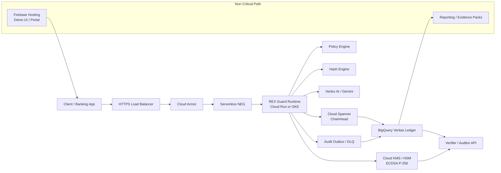
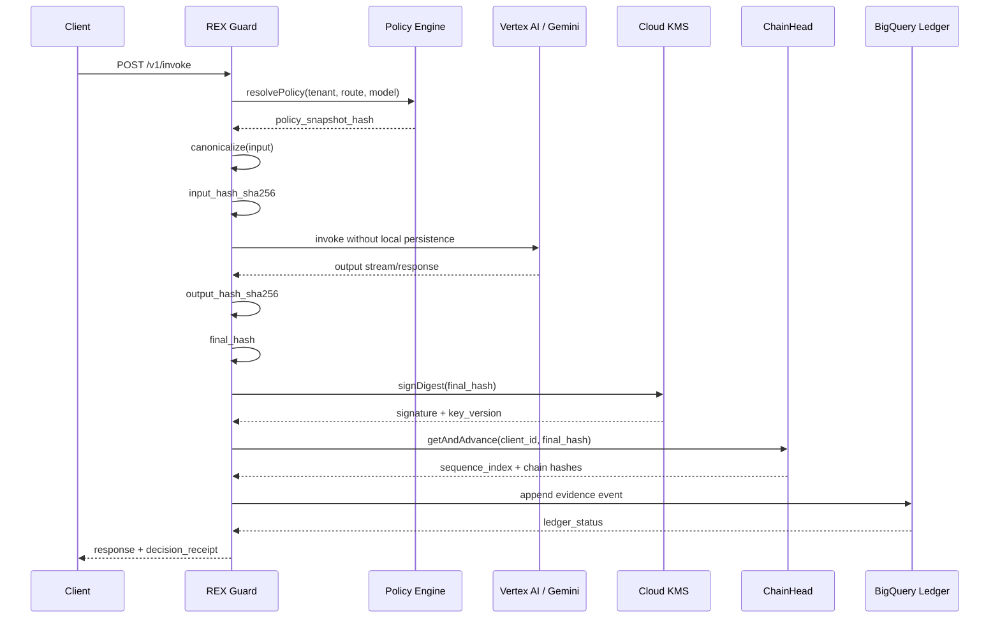
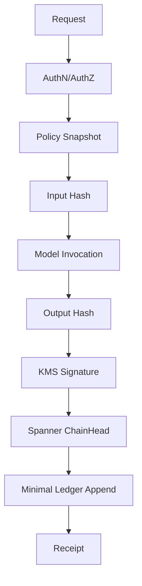
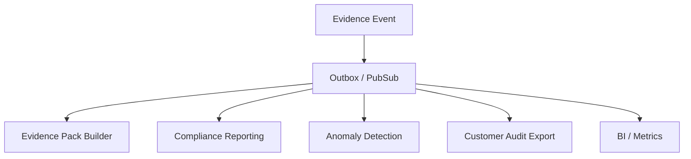
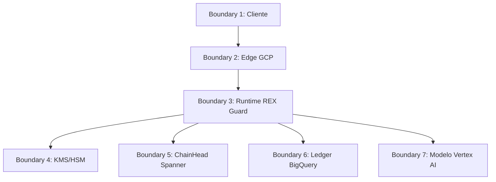

# REX Guard — Production Architecture v1.2

> Camada de governança criptográfica para inferências de IA generativa em ambientes regulados.  
> Baseada no princípio: **prove the decision, do not retain the secret**.

---

## 1. Contexto

Este documento especializa a arquitetura genérica de `secrecy-architecture` para o caso REX Guard: um runtime governance layer posicionado entre aplicações corporativas e provedores de IA generativa, com foco em evidência por decisão, zero-persistence operacional e comportamento fail-closed.

A versão v1.2 incorpora correções críticas de produção:

- Firebase Hosting fora do hot-path.
- TEE/Confidential Computing tratado como hardening Enterprise, não como premissa do MVP.
- BigQuery usado como ledger append-only, não como coordenador transacional.
- Cloud Spanner usado para ChainHead e avanço atômico de cadeia.
- SLO separado por rota, sem promessa única irreal.
- Gates síncronos reduzidos ao mínimo necessário.
- Failure modes e contratos explicitados.

---

## 2. Diagnóstico

A tese arquitetural é forte, mas produção bancária exige separar narrativa de enforcement.

### Problemas corrigidos

| Problema | Diagnóstico | Correção |
|---|---|---|
| Firebase no hot-path | Inadequado para tráfego bancário crítico | Firebase apenas para UI/demo/portal |
| Zero-Persistence misturado com TEE | Promessa excessiva sem enclave real | Baseline operacional; TEE como Enterprise hardening |
| BigQuery como coordenador | BigQuery não resolve sequência atômica por tenant | Spanner ChainHead para `getAndAdvance()` |
| Gates demais no síncrono | Latência explode | Separação hot-path vs async-path |
| SLO único | p95 ≤ 520ms não vale para RAG/modelo externo | SLO por rota e por modo |
| Compliance absoluto | Linguagem comercial perigosa | “mitiga”, “apoia”, “gera evidência” |

---

## 3. Objetivo

Permitir que cada chamada de IA gere uma prova verificável sem persistir o conteúdo sensível processado.

### Objetivos técnicos

- Processar payload sensível em memória volátil.
- Evitar persistência de prompt, resposta, documentos, chunks ou embeddings sensíveis.
- Gerar hashes canônicos de input/output/policy.
- Assinar digest final via Cloud KMS/HSM.
- Encadear recibos via ChainHead transacional.
- Persistir somente evidência não reversível em ledger.
- Bloquear inferência quando controles críticos falharem.

### Não-objetivos

- Não substituir parecer jurídico.
- Não prometer sigilo perfeito universal.
- Não prometer compliance automático.
- Não operar como GRC dashboard.
- Não armazenar payload para “facilitar auditoria”.

---

## 4. Arquitetura de Referência



---

## 5. Componentes

| Componente | Função | Criticidade | Falha |
|---|---|---:|---|
| HTTPS Load Balancer | Entrada TLS e roteamento | Alta | fail-closed por rota indisponível |
| Cloud Armor | WAF, rate limit e proteção de borda | Alta | bloqueia tráfego suspeito |
| REX Guard Runtime | Proxy stateless de governança | Crítica | fail-closed |
| Policy Engine | Resolve política aplicável | Crítica | fail-closed |
| Hash Engine | Canonicaliza e calcula SHA-256 | Crítica | fail-closed |
| Cloud KMS/HSM | Assina digest final | Crítica | fail-closed |
| Cloud Spanner | Coordena ChainHead | Crítica | fail-closed |
| BigQuery Ledger | Armazena evidência não sensível | Alta | degraded apenas com outbox durável |
| Audit Outbox/DLQ | Reconciliação de evidência | Alta | fail-closed se indisponível |
| Vertex AI/Gemini | Provedor de inferência | Alta | erro controlado |
| Firebase Hosting | UI/demo/portal | Baixa | sem impacto no core |

---

## 6. Fluxo Síncrono



### Ordem de selagem

1. Resolver política.
2. Canonicalizar input em RAM.
3. Calcular `input_hash_sha256`.
4. Executar inferência.
5. Canonicalizar output em RAM.
6. Calcular `output_hash_sha256`.
7. Compor `final_hash`.
8. Assinar digest via KMS.
9. Avançar ChainHead no Spanner.
10. Persistir evidence event no BigQuery.
11. Retornar resposta e recibo.

---

## 7. Hot-path vs Async-path

### Hot-path obrigatório



### Async-path



### Regra

Tudo que não altera permissão de inferência ou integridade do recibo deve sair do caminho síncrono.

---

## 8. Contratos

### 8.1 Decision Receipt

```json
{
  "decision_id": "uuid-v4",
  "tenant_id": "string",
  "route": "/v1/invoke",
  "model_id": "gemini-*",
  "policy_snapshot_hash": "sha256:hex",
  "input_hash_sha256": "sha256:hex",
  "output_hash_sha256": "sha256:hex",
  "final_hash": "sha256:hex",
  "signature": {
    "algorithm": "ECDSA_P256_SHA256",
    "kms_key_version": "projects/.../cryptoKeyVersions/N",
    "signature_base64": "string"
  },
  "chain": {
    "client_id": "string",
    "sequence_index": 123,
    "previous_hash": "sha256:hex|null",
    "current_hash": "sha256:hex"
  },
  "ledger_status": "sealed|degraded|pending_reconciliation",
  "created_at": "RFC3339"
}
```

### 8.2 Evidence Event

```json
{
  "schema_version": "veritas.evidence.v1",
  "decision_id": "uuid-v4",
  "tenant_id": "string",
  "environment": "dev|staging|prod",
  "route": "string",
  "model_provider": "google_vertex_ai",
  "model_id": "string",
  "model_version": "string|null",
  "policy_snapshot_hash": "sha256:hex",
  "input_hash_sha256": "sha256:hex",
  "output_hash_sha256": "sha256:hex",
  "final_hash": "sha256:hex",
  "signature_algorithm": "ECDSA_P256_SHA256",
  "kms_key_version": "string",
  "signature_base64": "string",
  "sequence_index": 123,
  "previous_hash": "sha256:hex|null",
  "current_hash": "sha256:hex",
  "latency_ms": 0,
  "ledger_status": "sealed",
  "created_at": "RFC3339"
}
```

### 8.3 ChainHead

```json
{
  "client_id": "string",
  "head_hash": "sha256:hex",
  "sequence_index": 123,
  "updated_at": "RFC3339",
  "last_decision_id": "uuid-v4"
}
```

---

## 9. `getAndAdvance()`

```typescript
type GetAndAdvanceInput = {
  clientId: string;
  decisionId: string;
  finalHash: string;
  createdAt: string;
};

type GetAndAdvanceOutput = {
  clientId: string;
  sequenceIndex: number;
  previousHash: string | null;
  currentHash: string;
  committedAt: string;
};
```

Pseudocódigo:

```typescript
async function getAndAdvance(input: GetAndAdvanceInput): Promise<GetAndAdvanceOutput> {
  return spanner.runTransactionAsync(async tx => {
    const head = await tx.readRow("ChainHead", input.clientId);

    const previousHash = head?.head_hash ?? null;
    const sequenceIndex = (head?.sequence_index ?? 0) + 1;

    const currentHash = sha256Canonical({
      client_id: input.clientId,
      decision_id: input.decisionId,
      sequence_index: sequenceIndex,
      previous_hash: previousHash,
      final_hash: input.finalHash,
      created_at: input.createdAt
    });

    await tx.upsert("ChainHead", {
      client_id: input.clientId,
      head_hash: currentHash,
      sequence_index: sequenceIndex,
      updated_at: input.createdAt,
      last_decision_id: input.decisionId
    });

    return {
      clientId: input.clientId,
      sequenceIndex,
      previousHash,
      currentHash,
      committedAt: input.createdAt
    };
  });
}
```

**Invariante:** duas decisões concorrentes do mesmo `client_id` não podem receber o mesmo `sequence_index`.

---

## 10. Zero-Persistence

### Permitido persistir

- hashes SHA-256;
- assinatura KMS;
- versão da política;
- identificadores técnicos;
- timestamps;
- status do ledger;
- sequence index;
- métricas agregadas sem payload.

### Proibido persistir

- prompt bruto;
- resposta bruta;
- documento bruto;
- chunks de RAG;
- embeddings reconstruíveis ou associados a PII sem contrato específico;
- payload em Cloud Logging;
- payload em traces;
- payload em error reporting;
- payload em Pub/Sub;
- payload em Cloud Storage;
- payload em Firestore/Datastore;
- payload em Redis persistente;
- payload em BigQuery.

### Controles obrigatórios

| Controle | Implementação |
|---|---|
| Logs sem payload | redaction middleware + tests + logging exclusions |
| Sem volume persistente | Cloud Run sem volume; GKE com `emptyDir` em memória quando aplicável |
| `/tmp` não usado para payload | lint/test de escrita proibida |
| Tracing sanitizado | allowlist de atributos OpenTelemetry |
| Error reporting sanitizado | stack trace sem body |
| IAM mínimo | service accounts separadas |
| KMS digest-only | KMS assina digest, não payload |
| Ledger sem conteúdo | schema enforcement |
| CI gate | teste de payload leakage obrigatório |

---

## 11. Failure Modes

| Falha | Política | Motivo |
|---|---|---|
| Policy Engine indisponível | fail-closed | sem política válida não há decisão governada |
| Policy snapshot ausente | fail-closed | recibo sem política não é auditável |
| KMS indisponível | fail-closed | sem assinatura não há prova forte |
| KMS quota exceeded | fail-closed + circuit breaker | evita decisões sem assinatura |
| Spanner ChainHead indisponível | fail-closed | sem avanço atômico não há cadeia confiável |
| BigQuery indisponível | degraded somente com outbox durável | ledger pode reconciliar se evento selado existir |
| Outbox indisponível | fail-closed | sem persistência mínima da prova não há reconciliação |
| Vertex AI indisponível | erro controlado | sem modelo não há inferência |
| Cloud Logging detecta payload | poison pill | quebra de Zero-Persistence |
| Runtime tenta gravar payload em disco | poison pill | quebra de Zero-Persistence |
| Configuração de log insegura | poison pill | risco de vazamento irreversível |

### Códigos de erro

```json
{
  "errors": [
    { "code": "POLICY_UNAVAILABLE", "http_status": 503, "mode": "fail_closed" },
    { "code": "POLICY_SNAPSHOT_MISSING", "http_status": 500, "mode": "fail_closed" },
    { "code": "KMS_SIGNING_FAILED", "http_status": 503, "mode": "fail_closed" },
    { "code": "CHAINHEAD_ADVANCE_FAILED", "http_status": 503, "mode": "fail_closed" },
    { "code": "LEDGER_APPEND_DEGRADED", "http_status": 200, "mode": "degraded_with_outbox" },
    { "code": "ZERO_PERSISTENCE_VIOLATION", "http_status": 500, "mode": "poison_pill" },
    { "code": "MODEL_PROVIDER_UNAVAILABLE", "http_status": 502, "mode": "controlled_error" }
  ]
}
```

---

## 12. Poison Pill

Gatilhos mínimos:

- tentativa de logar request body ou response body;
- configuração de logger com payload bruto;
- ativação indevida de debug em produção;
- escrita de payload em `/tmp`, volume ou storage;
- ausência de logging exclusions obrigatórias;
- divergência de hash de artefato/container esperado;
- falha em policy snapshot obrigatório;
- mutação não autorizada de variáveis críticas.

Ações:

1. interromper novas requisições;
2. finalizar streams com erro controlado;
3. zerar buffers sensíveis quando possível;
4. emitir evento mínimo sem payload;
5. encerrar processo;
6. exigir rollback para revisão imutável conhecida.

---

## 13. Segurança e Compliance

### Trust boundaries



### Controles por camada

| Camada | Controles |
|---|---|
| Edge | TLS, Cloud Armor, WAF, rate limiting, IP allowlist opcional |
| Runtime | stateless, RAM-only, no body logging, poison pill, least privilege |
| Crypto | SHA-256, ECDSA P-256, KMS/HSM, key rotation, digest-only signing |
| Chain | Spanner transaction, sequência monotônica, hash encadeado |
| Ledger | BigQuery append-only por política, deletion protection, IAM insert-only |
| Network | VPC SC Enterprise, private Google access, restricted APIs, egress control |
| Supply Chain | Artifact Registry, digest pinning, Binary Authorization, CI gates |
| Observability | métricas sem payload, traces sanitizados, alertas por SLO |

### Linguagem regulatória correta

Usar:

- “mitiga risco”;
- “gera evidência verificável”;
- “apoia demonstração de controle”;
- “reduz superfície de retenção de dados”;
- “facilita auditoria técnica”.

Evitar:

- “garante conformidade”;
- “resolve BCB/LGPD”;
- “sigilo perfeito”;
- “imutabilidade absoluta”;
- “zero risco”.

---

## 14. SLOs e SLIs

### SLIs mínimos

```json
{
  "slis": [
    "request_success_rate",
    "policy_resolution_latency_ms",
    "kms_sign_latency_ms",
    "chainhead_advance_latency_ms",
    "ledger_append_latency_ms",
    "ledger_success_rate",
    "ledger_degraded_rate",
    "poison_pill_trigger_count",
    "zero_persistence_violation_count",
    "model_provider_error_rate",
    "p95_total_latency_ms",
    "p99_total_latency_ms"
  ]
}
```

### SLO por rota

| Rota | Escopo | SLO inicial |
|---|---|---:|
| `/v1/invoke:policy-only` | policy + hash + KMS + ChainHead + ledger mínimo | p95 ≤ 520 ms |
| `/v1/invoke:stream` | SSE + evidência + modelo externo | dependente do primeiro token |
| `/v1/invoke:rag` | retrieval + policy + modelo + evidência | benchmark obrigatório |
| `/v1/audit/verify` | verificação de recibo | p95 ≤ 300 ms |

---

## 15. Deployment mínimo

### Infraestrutura

- Cloud Run ou GKE Autopilot.
- External HTTPS Load Balancer.
- Cloud Armor.
- Serverless NEG.
- Cloud KMS key ring com ECDSA P-256.
- Cloud Spanner para ChainHead.
- BigQuery dataset de ledger com IAM restrito.
- Pub/Sub ou outbox equivalente para reconciliação.
- Secret Manager para config crítica e kill-switch.
- Artifact Registry com digest pinning.
- CI/CD com gates de segurança.
- Cloud Monitoring e alerting.

### Variáveis críticas

```bash
PROJECT_ID="foundlab-ati"
REGION="southamerica-east1"
SERVICE_NAME="rex-guard"
ENVIRONMENT="prod"
KMS_KEY_VERSION="projects/.../cryptoKeyVersions/1"
SPANNER_INSTANCE="rex-guard-chainhead"
SPANNER_DATABASE="veritas_chain"
BQ_DATASET="veritas_ledger"
BQ_TABLE="evidence_events"
ZERO_PERSISTENCE_MODE="enforced"
POISON_PILL_ENABLED="true"
LOG_BODY_ENABLED="false"
```

---

## 16. CI/CD Gates

| Gate | Critério |
|---|---|
| Unit tests | 100% para crypto/policy/chain critical path |
| Branch coverage | ≥ 90% em módulos críticos |
| Leak tests | payload não aparece em logs/traces/errors |
| Schema tests | evidence event sem campos proibidos |
| KMS tests | assinatura e verificação offline |
| Chain tests | concorrência sem sequence collision |
| IaC validation | Terraform plan sem recursos proibidos |
| Container scan | sem critical/high explorável no runtime |
| Binary provenance | digest fixado e verificável |

---

## 17. Auditoria e Verificação

### Fluxo de verificação offline

1. Cliente recupera payload em seu próprio ambiente, se permitido.
2. Cliente canonicaliza input/output com o mesmo algoritmo.
3. Cliente calcula hashes.
4. Cliente recompõe `final_hash`.
5. Cliente verifica assinatura ECDSA com chave pública do KMS.
6. Cliente consulta ledger por `decision_id`.
7. Cliente valida `sequence_index`, `previous_hash` e `current_hash`.

### Evidence Pack mínimo

```json
{
  "evidence_pack": {
    "decision_receipt": "json",
    "ledger_row": "json",
    "kms_public_key_reference": "string",
    "policy_snapshot_reference": "string",
    "schema_version": "veritas.evidence.v1",
    "verification_result": "valid|invalid",
    "generated_at": "RFC3339"
  }
}
```

---

## 18. Riscos e Mitigações

| Risco | Severidade | Mitigação |
|---|---:|---|
| Latência acima do prometido | Alta | SLO por rota, benchmark e async-path |
| KMS quota exhaustion | Alta | quota planning + circuit breaker |
| ChainHead bottleneck | Alta | particionamento por tenant/route quando necessário |
| BigQuery indisponível | Média/Alta | outbox durável + reconciliação |
| Logging acidental de payload | Crítica | redaction middleware + tests + poison pill |
| Claims excessivos de compliance | Alta | linguagem de mitigação, não garantia |
| TEE vendido sem implantação real | Alta | separar baseline, Enterprise e roadmap |
| Hash como dado pessoal vinculável | Média | DPIA/LIA e minimização contextual |
| CI/CD sem gate real | Alta | policy-as-code no pipeline |

---

## 19. ADRs

### ADR-001 — BigQuery como ledger, não coordenador

BigQuery armazena evidência. Spanner coordena ChainHead.

### ADR-002 — Firebase fora do core path

Firebase Hosting serve UI/demo/portal. Hot-path produtivo usa LB + Armor + runtime controlado.

### ADR-003 — KMS fail-closed

Sem assinatura KMS, não há decisão governada.

### ADR-004 — Ledger degraded apenas com outbox durável

BigQuery pode degradar somente se o evento selado estiver preservado em mecanismo durável.

### ADR-005 — TEE não é baseline

Confidential Computing é hardening Enterprise/roadmap, não premissa do MVP.

---

## 20. MVP real

### Dentro do MVP

- `/v1/invoke` com Gemini.
- Policy snapshot fixo/versionado.
- Hash input/output/policy.
- Assinatura KMS ECDSA P-256.
- ChainHead em Spanner.
- Ledger BigQuery sem payload.
- Receipt retornado ao cliente.
- Verificador offline.
- Leak tests em CI/CD.
- Cloud Armor + Load Balancer + Cloud Run.

### Fora do MVP

- RAG completo.
- OFAC inline.
- TEE obrigatório.
- Multi-cloud.
- Model risk scoring avançado.
- Dashboard executivo complexo.
- Automação completa de relatório regulatório.

---

## 21. Critérios de aceite

### Segurança

- [ ] Nenhum payload sensível aparece em logs, traces ou errors.
- [ ] KMS assina digest por decisão.
- [ ] IAM por service account separado e mínimo.
- [ ] Cloud Armor ativo.
- [ ] Poison Pill testado.
- [ ] Controle de supply chain ativo.

### Dados

- [ ] BigQuery ledger sem campos de payload.
- [ ] Spanner ChainHead com teste de concorrência.
- [ ] `sequence_index` monotônico por `client_id`.
- [ ] `previous_hash/current_hash` verificáveis.
- [ ] Evidence schema versionado.

### Operação

- [ ] SLO por rota definido.
- [ ] Alertas para KMS, Spanner, BigQuery, Vertex e Poison Pill.
- [ ] Runbook de KMS quota.
- [ ] Runbook de ledger degraded.
- [ ] Runbook de rollback.
- [ ] Dashboard de SLIs sem payload.

### Compliance

- [ ] Matriz BCB/LGPD revisada juridicamente.
- [ ] DPIA/LIA quando aplicável.
- [ ] Política de retenção do ledger definida por contrato.
- [ ] Export de evidence pack disponível.
- [ ] Linguagem comercial revisada para evitar promessa absoluta.

---

## 22. Conclusão

REX Guard não deve ser vendido como “IA segura” genérica. A proposta defensável é mais precisa:

> Uma camada de governança em tempo de execução que transforma cada chamada de IA em uma decisão verificável, assinada e auditável, sem armazenar o conteúdo sensível que originou a decisão.

Arquitetura correta para produção:

- Firebase fora do hot-path.
- Runtime atrás de Load Balancer e Cloud Armor.
- Policy Engine versionado.
- KMS/HSM para assinatura.
- Spanner para ChainHead transacional.
- BigQuery para Veritas Ledger.
- Zero-Persistence validado por teste.
- TEE como hardening Enterprise.
- SLO por rota.
- Fail-closed onde a prova depende do controle.
